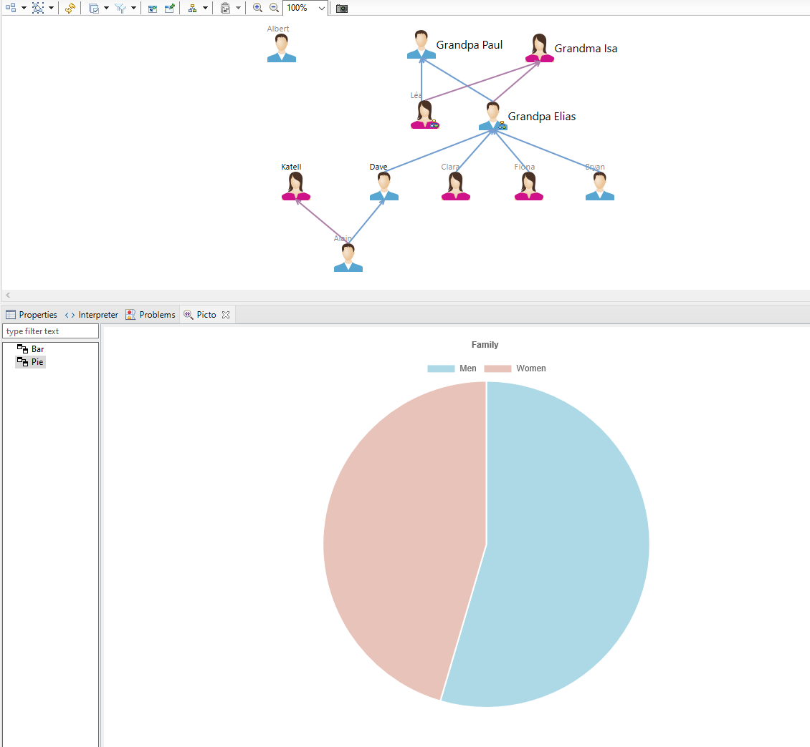
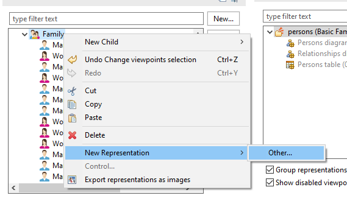
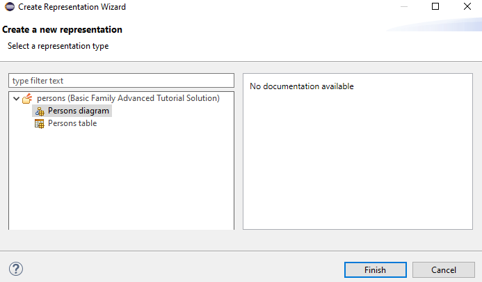
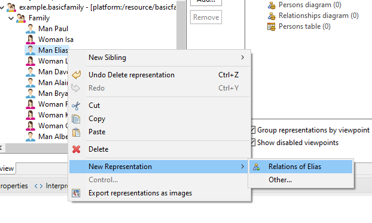
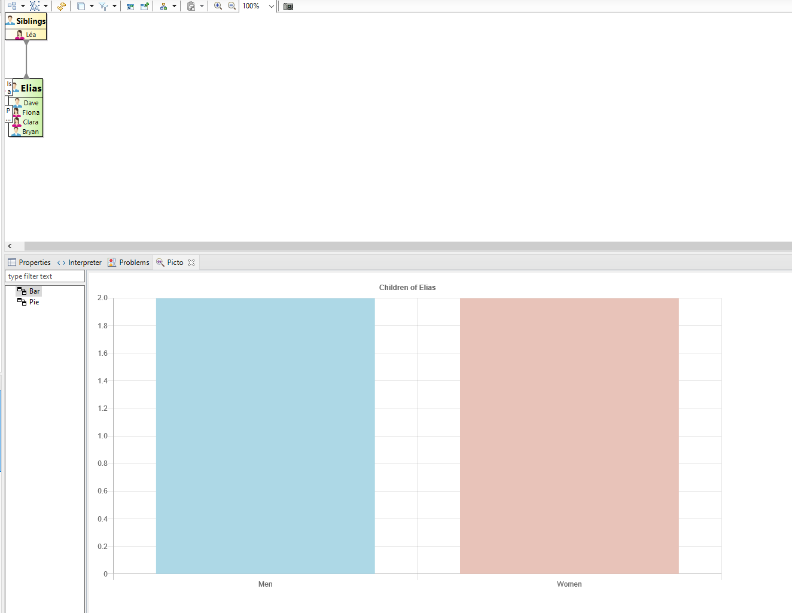

# Visualising Models with Picto and Sirius

Graphical modelling frameworks such as [Sirius](https://www.eclipse.org/sirius/) allow for models to be visualised and edited as diagrams, tables and trees. Sometimes it may be beneficial to visualise parts of the model in a different format, such as graphs. By combining both Sirius and Picto, you can combine the benefits of graphical editing, with the flexibility of rendering views using HTML/SVG/JavaScript-based technology. 



## Example

In this example, we will use the Sirius basicfamily example and render charts using [ChartJS](https://www.chartjs.org/).

1. Import the following projects using File>New>Other>Examples>Sirius Examples:
	- Basic Family Metamodel Definition
	(If you cannot see the Sirius Examples, you will need to install the samples feature from [here](https://wiki.eclipse.org/Sirius/Update_Sites#Releases))

2. Import the org.eclipse.epsilon.examples.picto.sirius plug-in project from the Epsilon repository. 

3. Launch a new runtime instance of Eclipse.

4. In the new runtime instance, import the following projects using File>New>Other>Examples>Sirius Examples:
	- Advanced Tutorial Solution 
	- Basic Family Sample Model projects

5. Open the Picto view (Window>Show View>Other>Picto)

6. In the basicfamily.sample project, create a new Persons diagram on the Family element. 

E.g. open the representations.aird file and do the following:





And click Finish

When opened you should see charts showing the number of males and females in the family 


7. Now create a new Relationships diagram on Elias



You should now see charts showing the number of male and female children of Elias 




## Modifying the Example

The org.eclipse.epsilon.examples.picto.sirius plug-in uses the pictoSource extension point and the BasicFamilyPictoSource class to allow Picto to obtain model elements and auto-refresh on save of the Sirius editor. This uses part of the Sirius API to get the root element of the diagram

```
	protected EObject getRootOfDiagram(IEditorPart editorPart) {
		if (isSiriusEditor(editorPart)) {
			DDiagramEditor editor = (DDiagramEditor) editorPart;
			DSemanticDiagramImpl diagram = (DSemanticDiagramImpl) editor.getRepresentation();
			return diagram.getTarget();
		}
		return null;
	}
	
	protected boolean isSiriusEditor(IEditorPart editorPart) {
		return editorPart instanceof DDiagramEditor;
	}
```

The basicfamily.egx file (located in the resources directory of the org.eclipse.epsilon.examples.picto.sirius plug-in) coordinates the generation of the Picto views.

The model2bar.egl and model2pie.egl files generates the respective bar and pie chart views using the ChartJS framework.

See [this page](https://www.eclipse.org/epsilon/doc/picto/) to learn more about Picto
